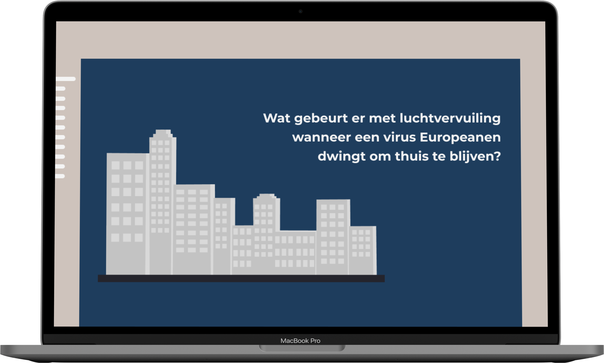

# id-knmi

Information Design Project KNMI




# Usage

for earth engine you need a private key

How to get private key see [developers.google.com/earth-engine](https://developers.google.com/earth-engine/guides/npm_install#server-side-authentication-with-a-service-account)

put private key path in `.env` file

example `.env`

```
PRIVATE_KEY=<FILENAME.JSON>

```

## Clone Project

```
git clone <reponame>
```

```
cd id-knmi
```

## Install Project

### Server

```
npm install
```

### Client

```
cd client
```

```
npm install
```

## Run Project Locally

run this command from `/id-knmi`

**Start React**

```
npm run start
```

**Start Server & React**

```
npm run dev
```
